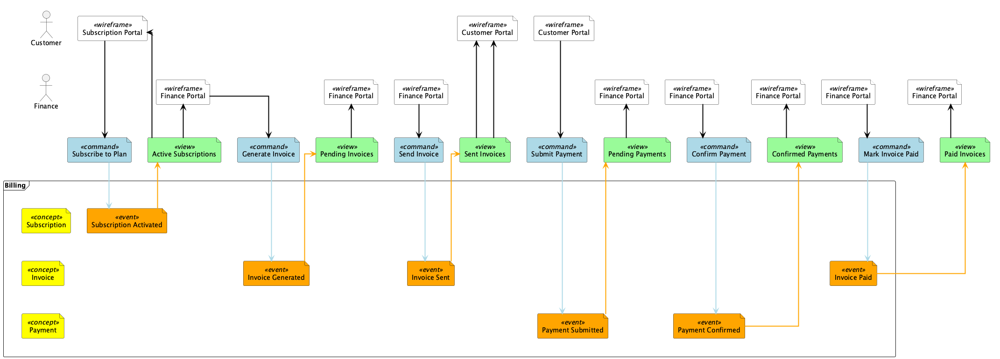
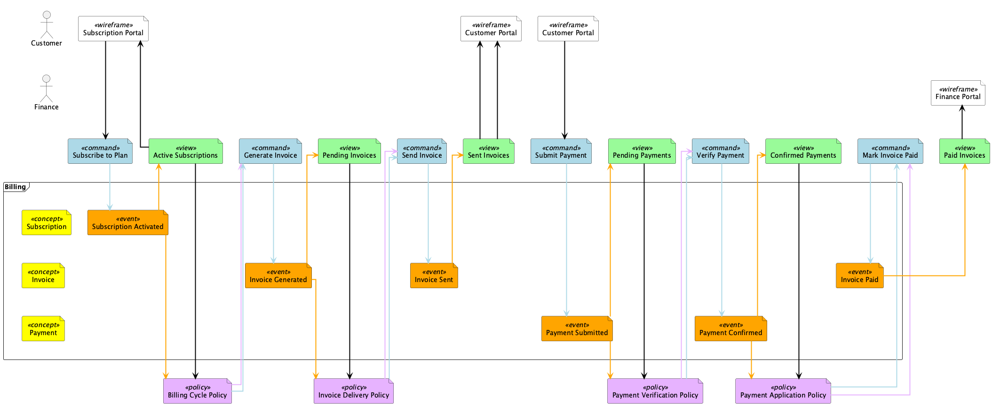
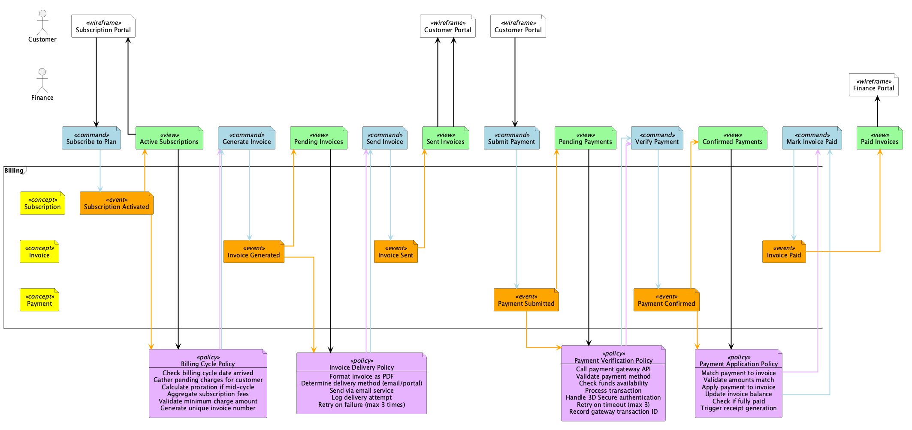
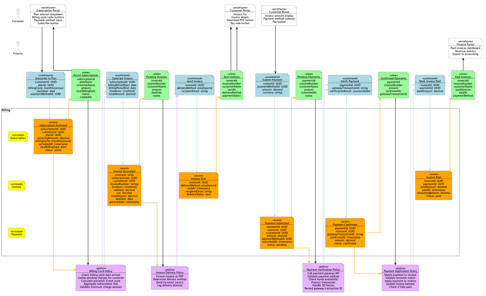

# What's New: Event Modeling Process Documentation

This update adds comprehensive documentation about the **event modeling process** to help users understand when and how to use different library features.

## New Documentation

### 📘 Core Guides

1. **[GETTING_STARTED.md](GETTING_STARTED.md)** - Step-by-step guide for first-time users
   - How to create your first diagram
   - Common pitfalls to avoid
   - When to add policies and fields (NOT at the beginning!)

2. **[examples/event-modeling-phases-guide.md](examples/event-modeling-phases-guide.md)** - Complete process walkthrough
   - The 7 steps of event modeling
   - Base model vs. sliced model
   - When to use each element type
   - Progressive examples through all phases

3. **[EVENT_MODELING_PROCESS_QUICK_REF.md](EVENT_MODELING_PROCESS_QUICK_REF.md)** - One-page reference
   - Quick lookup table for the 7 steps
   - When to use what elements
   - Common mistakes to avoid
   - Printable workshop reference

### 📊 Progressive Examples

Four new examples showing the same billing system through each phase:

1. **[subscription-billing-base.puml](examples/subscription-billing-base.puml)** 
   - **Phase 1:** Base model (Steps 1-6)
   - Clean business process
   - NO policies, NO fields
   - Focus on understanding

2. **[subscription-billing-with-policies.puml](examples/subscription-billing-with-policies.puml)**
   - **Phase 2:** Add automation (Step 7a)
   - Identifies what should be automated
   - Shows policy patterns

3. **[subscription-billing-with-rules.puml](examples/subscription-billing-with-rules.puml)**
   - **Phase 3:** Add business rules (Step 7b)
   - Defines policy logic
   - Specifies invariants

4. **[subscription-billing-sliced.puml](examples/subscription-billing-sliced.puml)**
   - **Phase 4:** Complete specification (Step 7c)
   - Full data structures
   - Implementation-ready

### 🎯 Updated Existing Docs

- **[readme.md](readme.md)** - Added prominent process guidance, quick start section
- **[examples/readme.md](examples/readme.md)** - Reorganized to feature progressive examples
- **[examples/fintech-billing-system-README.md](examples/fintech-billing-system-README.md)** - Updated to emphasize base model approach

## Key Teaching Points

### The Golden Rule

> **Start simple, add complexity progressively.**

Don't add `$policy()` or `$fields` until you've completed the base model and everyone understands the business process.

### The 7 Steps

1. **Brainstorming** - Identify events
2. **The Plot** - Order events on timeline
3. **The Storyboard** - Add wireframes
4. **Identify Inputs** - Add commands
5. **Identify Outputs** - Add views
6. **Apply Scenarios** - Organize into swim lanes
7. **Elaborate (Slicing)** - **← This is when policies and fields are added!**

### Base Model vs. Sliced Model

| Aspect | Base Model (Steps 1-6) | Sliced Model (Step 7) |
|--------|------------------------|----------------------|
| **Purpose** | Understand business process | Implementation planning |
| **Audience** | All stakeholders | Development team |
| **Policies** | ❌ No | ✅ Yes - for automation |
| **Fields** | ❌ No | ✅ Yes - data structures |
| **Focus** | WHAT happens | HOW it's implemented |

## Why This Matters

### Common Mistake

Many users jump straight to creating diagrams with policies and fields, which:
- Overwhelms stakeholders with technical details
- Obscures the business process
- Makes workshops less effective
- Reduces collaboration

### Better Approach

1. **First:** Create a base model to understand the business
2. **Then:** Add policies to identify automation
3. **Finally:** Add fields for implementation details

## What Changed in Examples

### Before
- Examples mixed base models and sliced models
- No clear guidance on when to add policies
- Fields shown as optional feature without context

### After
- Clear separation: base models vs. sliced models
- Explicit guidance: policies are for Step 7 (slicing)
- Progressive examples showing the journey
- Warnings in documentation about when to use what

## For Existing Users

If you've been using this library:

- ✅ Your existing diagrams still work
- ✅ No breaking changes to syntax
- ✅ New documentation helps explain when to use features
- ℹ️ Consider separating your diagrams into base + sliced versions

## Visual Comparison

See the progression in action:

**Phase 1: Base Model**

Simple, clean, focused on business process.

**Phase 2: With Policies**

Automation identified.

**Phase 3: With Business Rules**

Logic specified.

**Phase 4: Fully Sliced**

Complete implementation specification.

## Resources for Learning

1. Start with [GETTING_STARTED.md](GETTING_STARTED.md)
2. Read the [Process Guide](examples/event-modeling-phases-guide.md)
3. Study the [progressive examples](examples/)
4. Use the [Quick Reference](EVENT_MODELING_PROCESS_QUICK_REF.md) in workshops
5. Visit [EventModeling.org](https://eventmodeling.org/) for methodology details

## Feedback

This documentation update aims to make the library more accessible and to teach proper event modeling methodology. If you have suggestions or find areas that need clarification, please open an issue!

---

**Remember:** Event modeling is a collaborative workshop technique. Start simple, build shared understanding, then add technical details during slicing!
